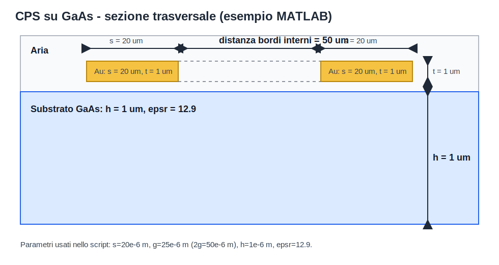
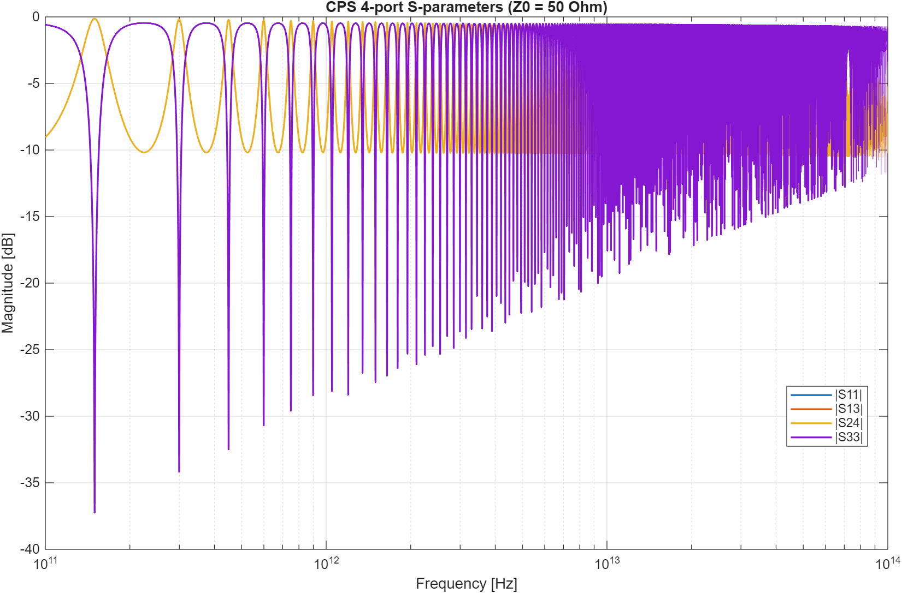

# Example: gold CPS on GaAs

Questo esempio usa le routine del repository per il caso:

- due strisce d'oro larghe **20 um**
- alte **1 um** (spessore fisico riportato, non incluso nel modello chiuso Eq. 1-8)
- distanza tra i bordi interni **50 um** (quindi `2g = 50 um`, `g = 25 um`)
- substrato GaAs di spessore **1 um**

## Immagine della struttura



## Permittività relativa del GaAs

Valore usato: **epsr = 12.9** (300 K, dielectric constant static).

Fonte:
- Ioffe Institute, *Basic Parameters of Gallium Arsenide (GaAs)*  
  https://www.ioffe.ru/SVA/NSM/Semicond/GaAs/basic.html

## Script MATLAB

Esegui:

```matlab
example_gaas_gold_cps
```

Lo script calcola:

- `Cpul` (capacità per unità di lunghezza)
- `Z0` (impedenza caratteristica)
- `Rpul` (matrice 2x2 di resistenza per unità di lunghezza) considerando skin depth
- `Lpul` tramite:

Per esportare gli S-parameters 4 porte in Touchstone standard:

```matlab
example_export_s4p
```

Questo script genera (configurato per `fmin=100e9`, `fmax=100e12`, `Nfreq=10000`):

- `gaas_gold_cps_4port_100GHz_100THz.s4p`
- `gaas_gold_cps_4port_100GHz_100THz_plot.png`

con:

- `Cpul` e `Lpul` costanti in frequenza
- `Gpul = 0`
- `Rpul(f)` valutata tra `fmin` e `fmax` in `Nfreq` punti
- punti di frequenza in `logspace` (distribuiti per decade)
- normalizzazione `Z0 = 50 Ohm` su tutte le 4 porte

### Plot esportato



```matlab
Lpul = Z0^2 * Cpul
```

Per la parte resistiva HF viene usato:

```matlab
delta = sqrt(2/(omega*mu*sigma))
Rs = 1/(sigma*delta)
R_strip = Rs/(2*(s+t))
Rpul = [R_strip 0; 0 R_strip]
```

## Risultato numerico atteso

Con i parametri sopra:

- `Cpul ≈ 1.062525e-11 F/m` (`10.625253 pF/m`)
- `Z0 ≈ 314.152540 Ohm`
- `Lpul ≈ 1.048626e-06 H/m` (`1048.625523 nH/m`)
- a `f = 10 GHz`, `sigma_Au = 4.10e7 S/m`:
  - `delta ≈ 0.786802 um`
  - `Rpul ≈ [738.8224, 0; 0, 738.8224] Ohm/m`
  - `Rdiff_pul ≈ 1477.6448 Ohm/m`
