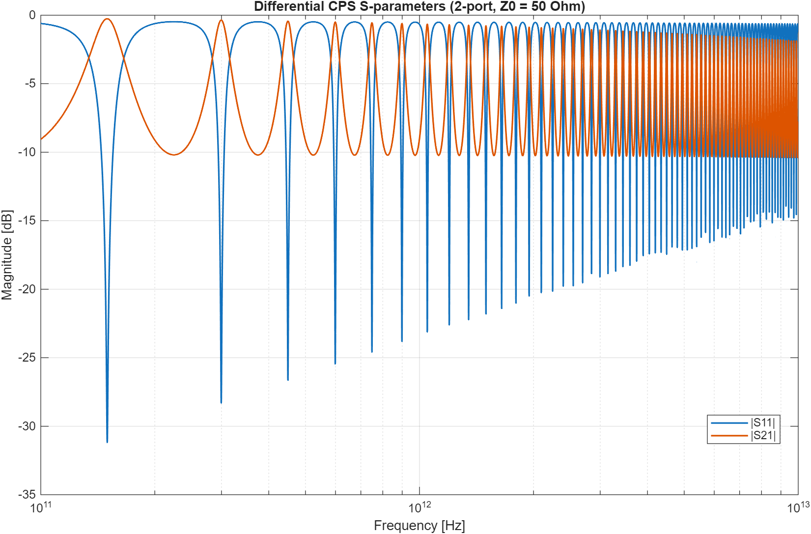
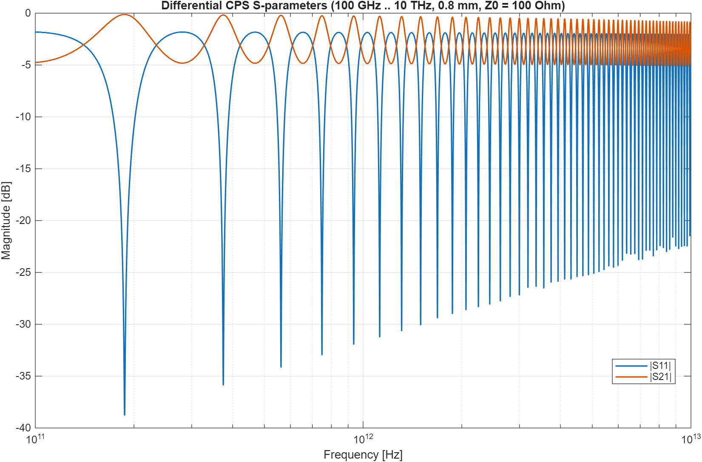
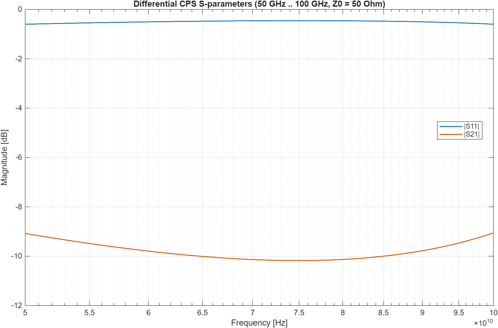
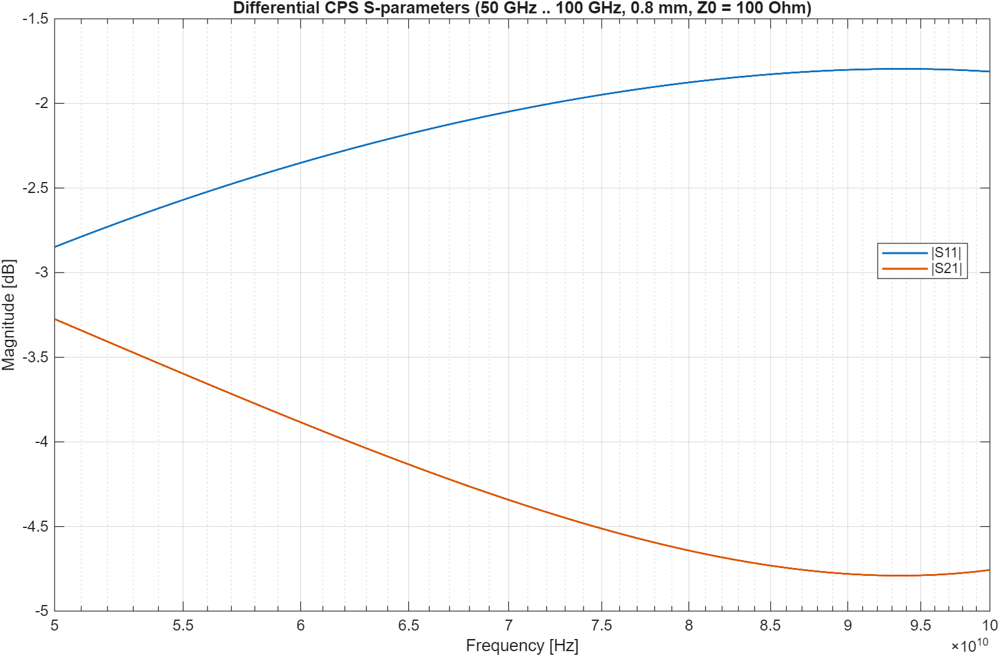
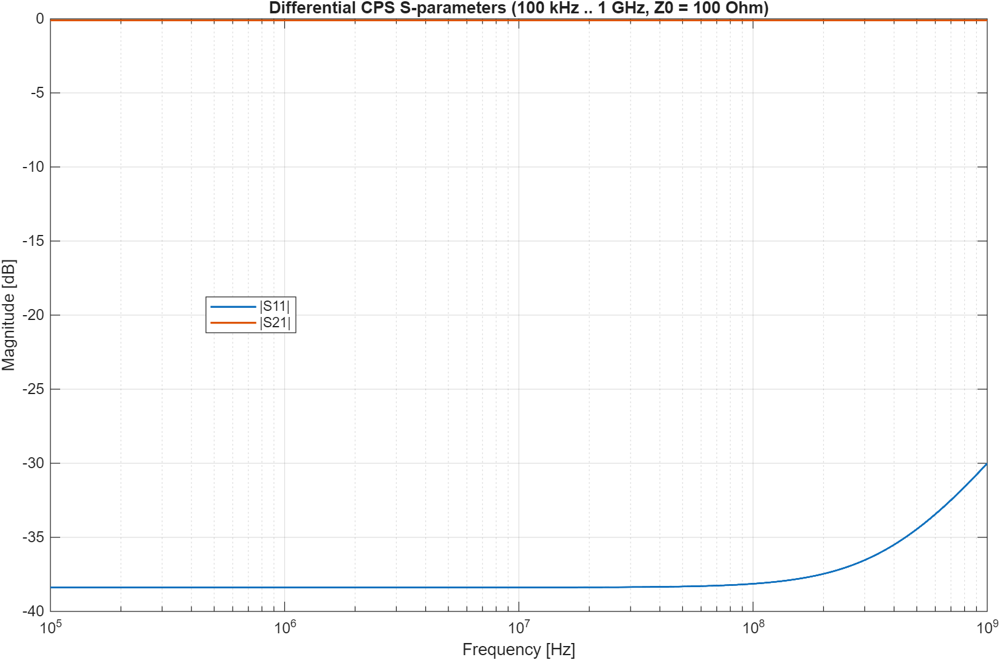
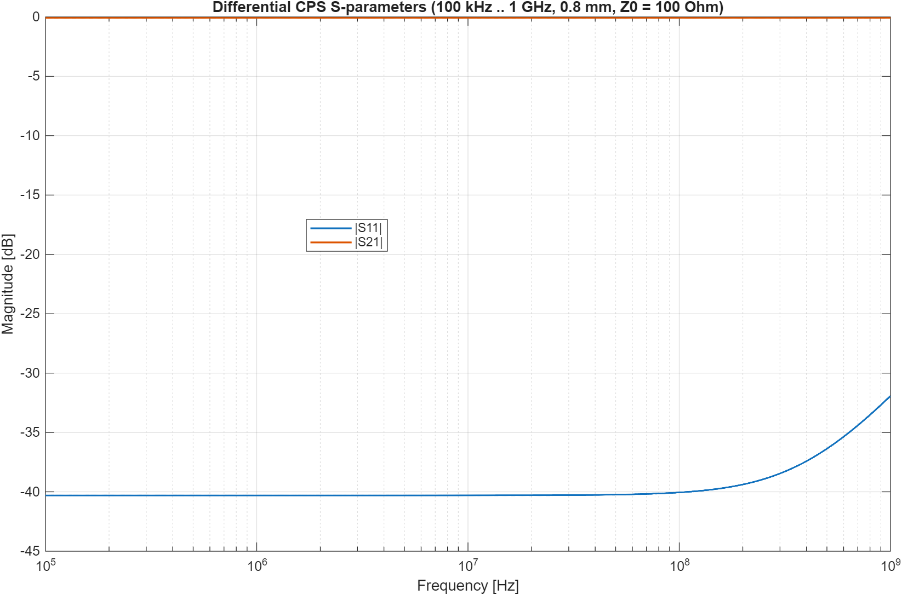

# Example: gold CPS on GaAs

Questo esempio usa le routine del repository per il caso:

- due strisce d'oro larghe **20 um**
- alte **1 um** (spessore fisico riportato, non incluso nel modello chiuso Eq. 1-8)
- distanza tra i bordi interni **50 um** (quindi `2g = 50 um`, `g = 25 um`)
- substrato GaAs di spessore **1 um**

## Immagine della struttura


## Permittività relativa del GaAs

Valore usato: **epsr = 12.9** (300 K, dielectric constant static).

Fonte:
- Ioffe Institute, *Basic Parameters of Gallium Arsenide (GaAs)*  
  https://www.ioffe.ru/SVA/NSM/Semicond/GaAs/basic.html

## Script MATLAB

Esegui:

```matlab
example_gaas_gold_cps
```

Lo script calcola:

- `Cpul` (capacità per unità di lunghezza)
- `Z0` (impedenza caratteristica)
- `Rpul` (resistenza differenziale per unità di lunghezza, scalare) considerando skin depth
- `Lpul` tramite:

Per esportare gli S-parameters differenziali 2 porte in Touchstone standard:

```matlab
example_export_s2p
```

Questo script genera (configurato per `fmin=100e9`, `fmax=10e12`, `Nfreq=10000`):

- `gaas_gold_cps_diff_2port_100GHz_10THz.s2p`
- `gaas_gold_cps_diff_2port_100GHz_10THz_plot.png`

Per la variante con lunghezza linea `0.8 mm`:

```matlab
example_export_s2p_100GHz_10THz_0p8mm
```

Questo script genera:

- `gaas_gold_cps_diff_2port_100GHz_10THz_0p8mm.s2p`
- `gaas_gold_cps_diff_2port_100GHz_10THz_0p8mm_plot.png`

Per la variante `0.8 mm` nel range `50e9 .. 100e9`:

```matlab
example_export_s2p_50_100GHz_0p8mm
```

Questo script genera:

- `gaas_gold_cps_diff_2port_50GHz_100GHz_0p8mm.s2p`
- `gaas_gold_cps_diff_2port_50GHz_100GHz_0p8mm_plot.png`

Per un secondo esempio in banda più stretta (`50e9 .. 100e9`):

```matlab
example_export_s2p_50_100GHz
```

Questo script genera:

- `gaas_gold_cps_diff_2port_50GHz_100GHz.s2p`
- `gaas_gold_cps_diff_2port_50GHz_100GHz_plot.png`

Per un terzo esempio in banda bassa (`100e3 .. 1e9`):

```matlab
example_export_s2p_100kHz_1GHz
```

Questo script genera:

- `gaas_gold_cps_diff_2port_100kHz_1GHz.s2p`
- `gaas_gold_cps_diff_2port_100kHz_1GHz_plot.png`

Per la variante `0.8 mm` nel range `100e3 .. 1e9`:

```matlab
example_export_s2p_100kHz_1GHz_0p8mm
```

Questo script genera:

- `gaas_gold_cps_diff_2port_100kHz_1GHz_0p8mm.s2p`
- `gaas_gold_cps_diff_2port_100kHz_1GHz_0p8mm_plot.png`

Per convertire un file Touchstone single-ended 4 porte in differenziale 2 porte:

```matlab
convert_s4p_to_diff_s2p('input.s4p','output_diff.s2p',[1 3],[2 4]);
```

La funzione controlla che il file input abbia Z0 di normalizzazione coerente (default 50 Ohm single-ended) e scrive output differenziale con default 100 Ohm.

con:

- `Cpul` e `Lpul` costanti in frequenza (scalari differenziali)
- `Gpul = 0`
- `Rpul(f)` valutata tra `fmin` e `fmax` in `Nfreq` punti
- punti di frequenza in `logspace` (distribuiti per decade)
- normalizzazione `Z0 = 100 Ohm`

### Plot esportato








```matlab
Lpul = Z0^2 * Cpul
```

Per la parte resistiva HF viene usato:

```matlab
delta = sqrt(2/(omega*mu*sigma))
Rs = 1/(sigma*delta)
Ae = s*t - max(s-2*delta,0)*max(t-2*delta,0)
R_strip = 1/(sigma*Ae)
Rpul = 2*R_strip
```

Se `delta >= min(s,t)/2`, il conduttore e' completamente penetrato e il modello usa automaticamente l'area piena `Ae = s*t`.

## Risultato numerico atteso

Con i parametri sopra:

- `Cpul ≈ 1.062525e-11 F/m` (`10.625253 pF/m`)
- `Z0 ≈ 314.152540 Ohm`
- `Lpul ≈ 1.048626e-06 H/m` (`1048.625523 nH/m`)
- a `f = 10 GHz`, `sigma_Au = 4.10e7 S/m`:
  - `delta ≈ 0.786010 um`
  - `Rpul ≈ 2439.0244 Ohm/m`
  - `Rdiff_pul ≈ 2439.0244 Ohm/m`
